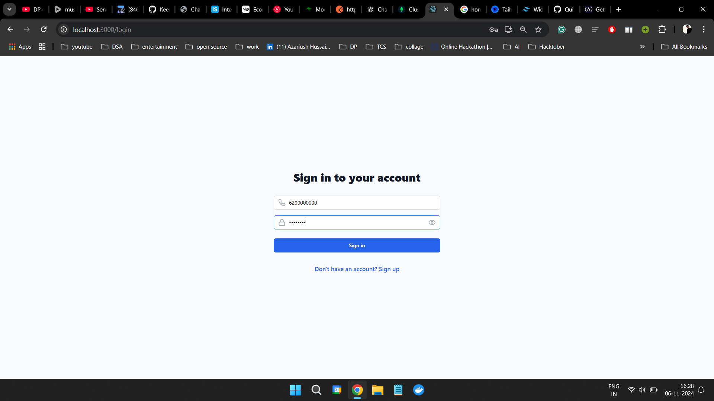
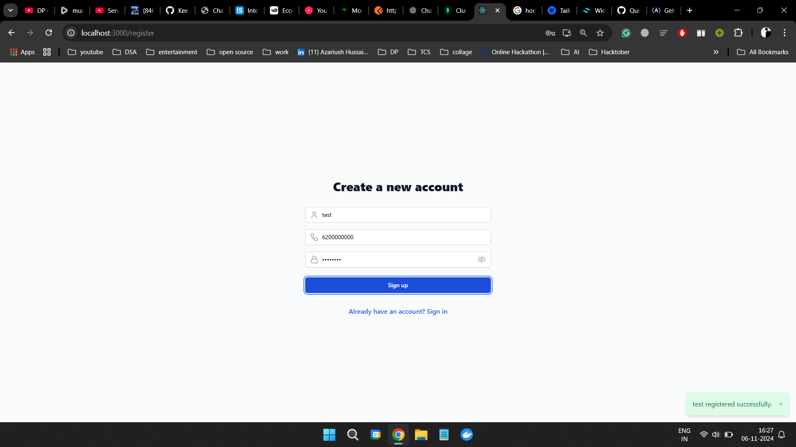
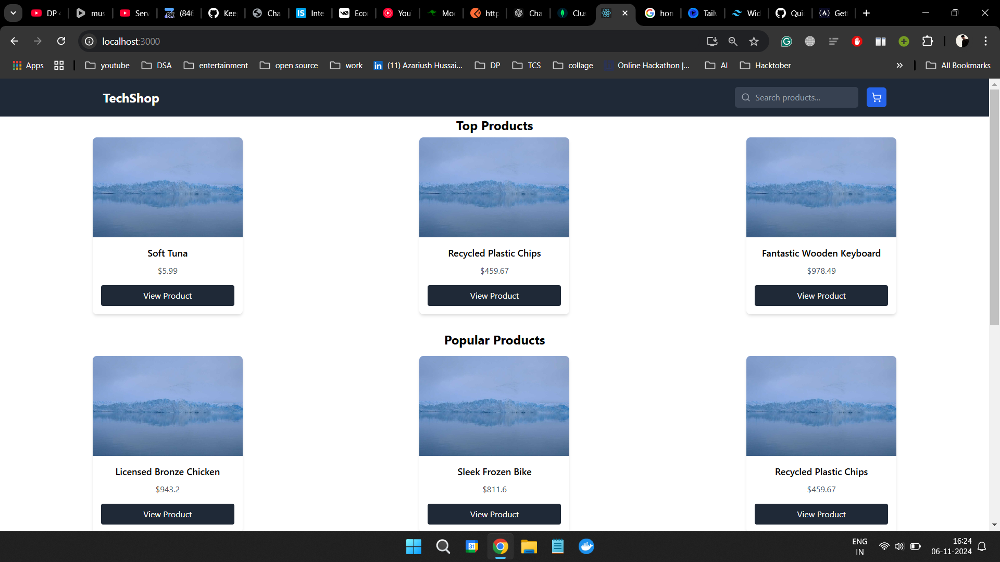
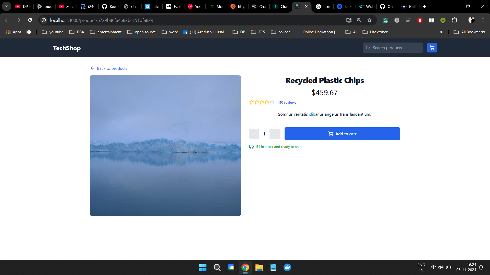
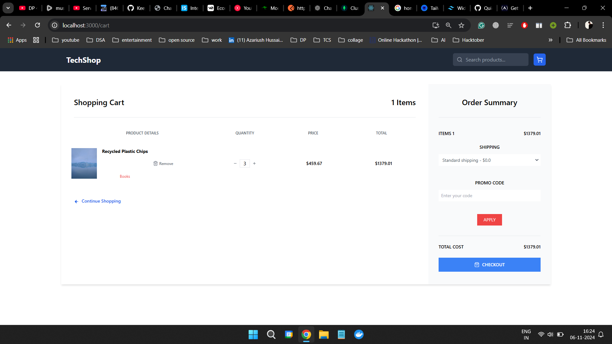
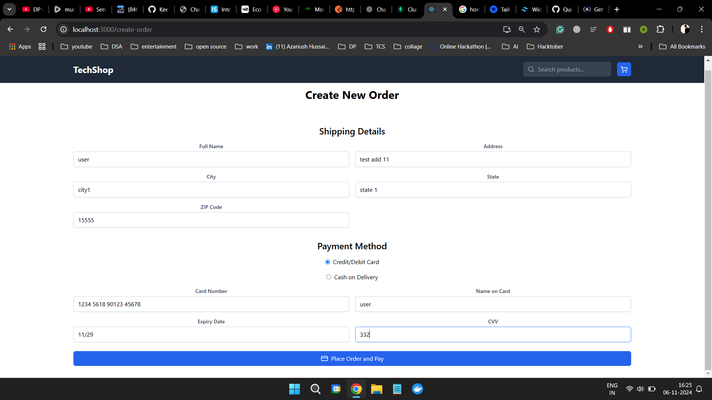
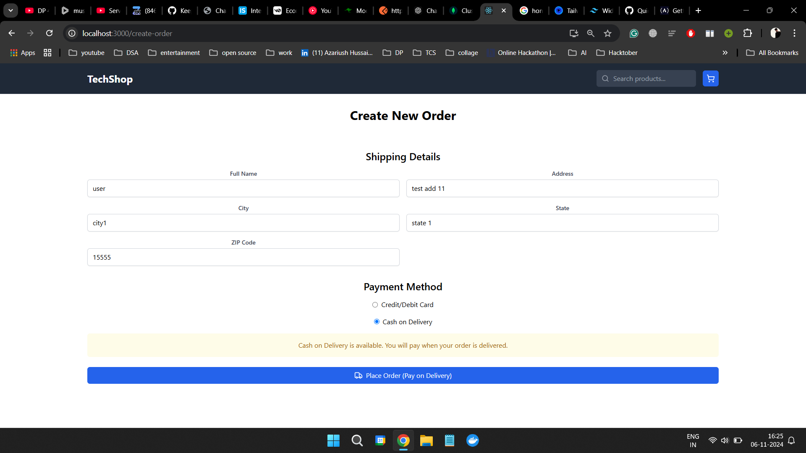

---

# E-Commerce MERN Application

An e-commerce web application built using the MERN stack (MongoDB, Express, React, Node.js) with a focus on covering all aspects required in the assignment, including product listings, a shopping cart, order management, and checkout functionality.
## Table of Contents
- [Screens Preview](#screens-preview)
- [Project Structure](#project-structure)
- [Setup Instructions](#setup-instructions)
  - [Backend Setup](#backend-setup)
  - [Frontend Setup](#frontend-setup)
- [Environment Variables](#environment-variables)

---

### Screens Preview

<!-- Include screenshots here with Markdown syntax -->
| Screen               | Preview                                |
|----------------------|----------------------------------------|
| **Login**            | |
| **Register**         | 
| **Home**             |  |
| **Product Details**  |  |
| **Cart**             |  |
| **Checkout-card**         |  |
| **Checkout-cod** |  |

---

### Project Structure

```
ecommerce
├── Backend
│   ├── controllers
│   ├── models
│   ├── routes
│   ├── utils
│   ├── .env          # Environment variables for backend
│   ├── package.json
│   └── server.js
├── frontend
│   ├── public
│   ├── src
│   │   ├── components
│   │   ├── pages
│   │   ├── context
│   │   ├── hooks
│   │   ├── App.js
│   │   └── index.js
│   ├── .env          # Environment variables for frontend
│   └── package.json
└── README.md
```

---

### Setup Instructions

To set up this project on your local machine, follow these steps for both the backend and frontend.

#### Backend Setup

1. **Navigate to the backend folder**:
   ```bash
   cd Backend
   ```

2. **Install dependencies**:
   ```bash
   npm install
   ```

3. **Configure environment variables**: Create a `.env` file in the `Backend` folder and add the following variables:

   ```plaintext
   MONGO_URI=mongodb://your-mongodb-connection-string
   JWT_SECRET=your_jwt_secret_key
   TOKEN_EXPIRATION='30d'
   ```

4. **Run the server**:
   ```bash
   npm start
   ```

5. **Access the backend**: The backend will be available at `http://localhost:8080`.

#### Frontend Setup

1. **Navigate to the frontend folder**:
   ```bash
   cd frontend
   ```

2. **Install dependencies**:
   ```bash
   npm install
   ```

3. **Configure environment variables**: Create a `.env` file in the `frontend` folder and add the following variables:

   ```plaintext
    REACT_APP_API_URL='http://localhost:8000/api/'
   ```

4. **Run the React app**:
   ```bash
   npm start
   ```

5. **Access the frontend**: The frontend will be available at `http://localhost:3000`.

---

### Environment Variables

Each part of the project has its own environment variables, which should be stored in a `.env` file in the respective folders.

#### Backend `.env` Structure

| Variable    | Description                          |
|-------------|--------------------------------------|
| MONGO_URI   | MongoDB connection string            |
| JWT_SECRET  | Secret key for JSON Web Token        |
| TOKEN_EXPIRATION | Expiration time of token       |

#### Frontend `.env` Structure

| Variable              | Description                        |
|-----------------------|------------------------------------|
| REACT_APP_API_URL     | Backend API base URL              |

---
